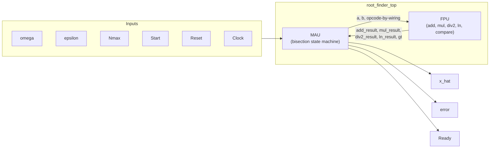
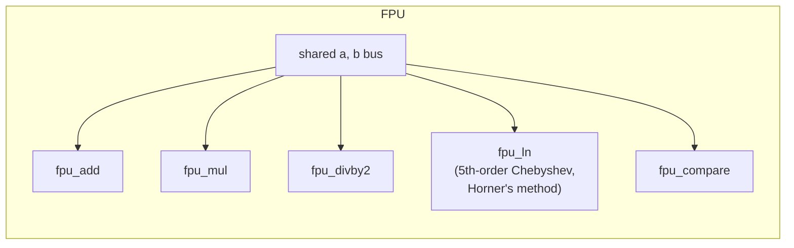
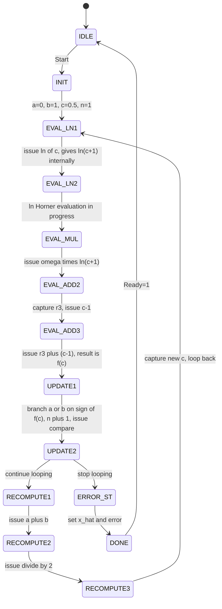

# Root-Finding IC (Bisection Method, Verilog)

A hardware implementation of the bisection root-finding method for

```
f(x) = ω·ln(x+1) + (x-1) = 0
```

built around a small shared **FPU** (fixed-point arithmetic unit) and a
**MAU** (Master-Algorithm-Unit) that runs the bisection loop and consults
the FPU for every arithmetic step.

## Background

This started as a university digital systems design (EE3205-style) group
assignment from 2019. The original submission's FPU+MAU architecture and
the core `ln(x)` approximation were genuine, working ideas — but the
top-level integration was never fully completed, and an `ln(x+1)` term
that was actually a **Chebyshev polynomial approximation** had been
mislabeled as a Taylor series in later write-ups.

This repository is a from-scratch, corrected, and fully simulated
rebuild: same core idea (FPU + MAU, bisection, the verified Chebyshev
`ln(x)` module), but with the state machine, number format, and
top-level integration redesigned and verified end-to-end in simulation
rather than assumed to work.

## Architecture



The FPU has no opcode input. Every sub-module runs continuously off the
same shared `a`/`b` operand bus and exposes its own dedicated result
wire; the MAU (which already knows what operation it issued in which
state) just reads whichever wire is relevant that cycle. An earlier
version routed everything through a single opcode-selected `result` mux
and broke under simulation — see [Bugs found by simulation](#bugs-found-by-simulation-not-just-code-review).



## Number format

All values (`omega`, `epsilon`, `a`, `b`, `c`, `f(c)`, ...) use an 18-bit
signed **Q16 fixed-point** format: 1 sign bit + 1 integer bit + 16
fractional bits. Real value = raw integer ÷ 65536. This gives a
representable range of **[-2.0, +2.0)** — note 2.0 itself overflows
(wraps to -2.0 in two's complement), which is a real constraint on
`omega`, not just a simulation footnote.

`Nmax` (the iteration cap) is a separate plain 16-bit integer — it
doesn't fit Q16's small range and isn't an arithmetic operand for the
FPU at all, just a loop counter compared against `n`.

## MAU state machine



A state *issues* an FPU operation by driving `a`/`b`; because every FPU
sub-module is individually registered, that operation's dedicated result
wire becomes valid starting the *next* state. If a result is needed only
in that very next state, it's read straight off the wire — no register
needed. If it must survive an unrelated, intervening operation (e.g.
`omega*ln(c+1)` surviving `EVAL_ADD2`'s unrelated `c-1` computation), it's
captured into a dedicated register. Only one such register (`r3`) is
needed for the entire `f(c)` evaluation chain.

The spec's literal loop condition was `while (|f(c)|>epsilon OR n<=Nmax)`
— using `OR` there is a bug (it never lets the loop stop early once
`n<=Nmax`, and can't stop at all once `n>Nmax` either, since at that
point the first term still needs to be false). The corrected condition,
used here, is `AND`.

## Bugs found by simulation, not just code review

Three real bugs were caught only once the design was actually simulated
end-to-end, not by reading the code:

1. **FPU result mux** selected which sub-module's output to expose based
   on the *current* opcode — so the instant the MAU advanced to the next
   operation, the mux immediately started showing the new operation's
   result, even on the cycle still needing the previous result. Fixed by
   giving every sub-module its own dedicated, unmuxed result wire.
2. **Double `+1`**: `ln`'s polynomial already computes `ln(1+x_in)`
   internally (confirmed by hand-evaluating its coefficients at `x=0.5`
   and getting `~0.4055 = ln(1.5)`, not `ln(0.5)`). An extra adder was
   feeding it `c+1`, causing `ln(1+(c+1)) = ln(c+2)` instead of
   `ln(c+1)`. Fixed by feeding `c` directly and removing the now-redundant
   state.
3. **Multiplier truncation**: `(a*b) >>> 16` computed the product in the
   context of the 18-bit result register, silently truncating it to 18
   bits *before* the shift — discarding exactly the bits the shift
   needed. Fixed with a wide intermediate product (same pattern already
   used correctly inside `fpu_ln.v`'s Horner evaluation).

## Simulation

Verified with [Icarus Verilog](http://iverilog.icarus.com/):

```sh
iverilog -g2012 -o sim/tb.vvp src/fpu_add.v src/fpu_mul.v src/fpu_divby2.v \
    src/fpu_ln.v src/fpu_compare.v src/fpu.v src/mau.v src/root_finder_top.v \
    sim/tb_root_finder.v
vvp sim/tb.vvp
```

`sim/tb_root_finder.v` checks convergence against hand-computed roots for
three different `omega` values, plus one deliberately under-resourced
case (too few iterations) to confirm the error-exit path itself works:

```
PASS: omega=1.000000 x_hat=0.556641 expected=0.557100 (diff=-0.000459)
PASS: omega=1.500000 x_hat=0.446289 expected=0.446500 (diff=-0.000211)
PASS: omega=0.500000 x_hat=0.726562 expected=0.727000 (diff=-0.000437)
PASS: omega=1.000000 Nmax=3 correctly reported error (did not converge in time)
---- 4 passed, 0 failed ----
```

## Files

- `src/fpu_add.v`, `fpu_mul.v`, `fpu_divby2.v`, `fpu_compare.v` — single-cycle
  fixed-point arithmetic primitives.
- `src/fpu_ln.v` — 5th-order Chebyshev polynomial approximation of
  `ln(1+x)`, evaluated via Horner's method (2-cycle latency).
- `src/fpu.v` — top-level FPU, wiring the above in parallel off a shared
  operand bus.
- `src/mau.v` — the bisection state machine.
- `src/root_finder_top.v` — top-level pin interface matching the
  original assignment spec (`omega, Nmax, epsilon, Start, Reset, Clock`
  in; `x_hat, error, Ready` out).
- `sim/tb_root_finder.v` — self-checking testbench.

## Credit

Originally a three-person university group project; the FPU/MAU
architecture and the Chebyshev `ln(x)` approximation trace back to that
submission. This repository is an independent rebuild of the arithmetic
and control logic, corrected and verified from scratch.
